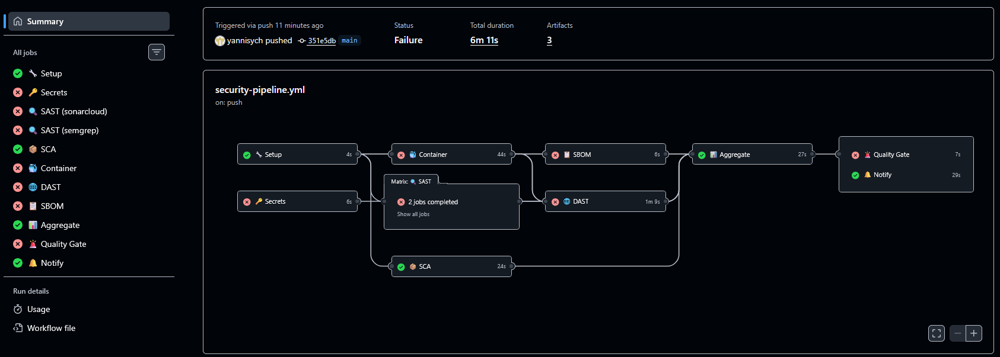
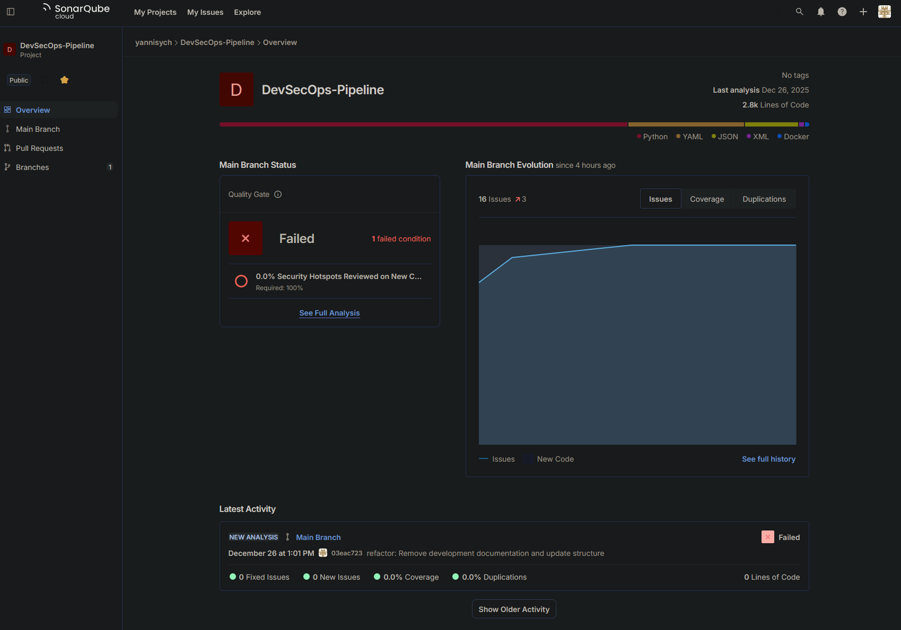
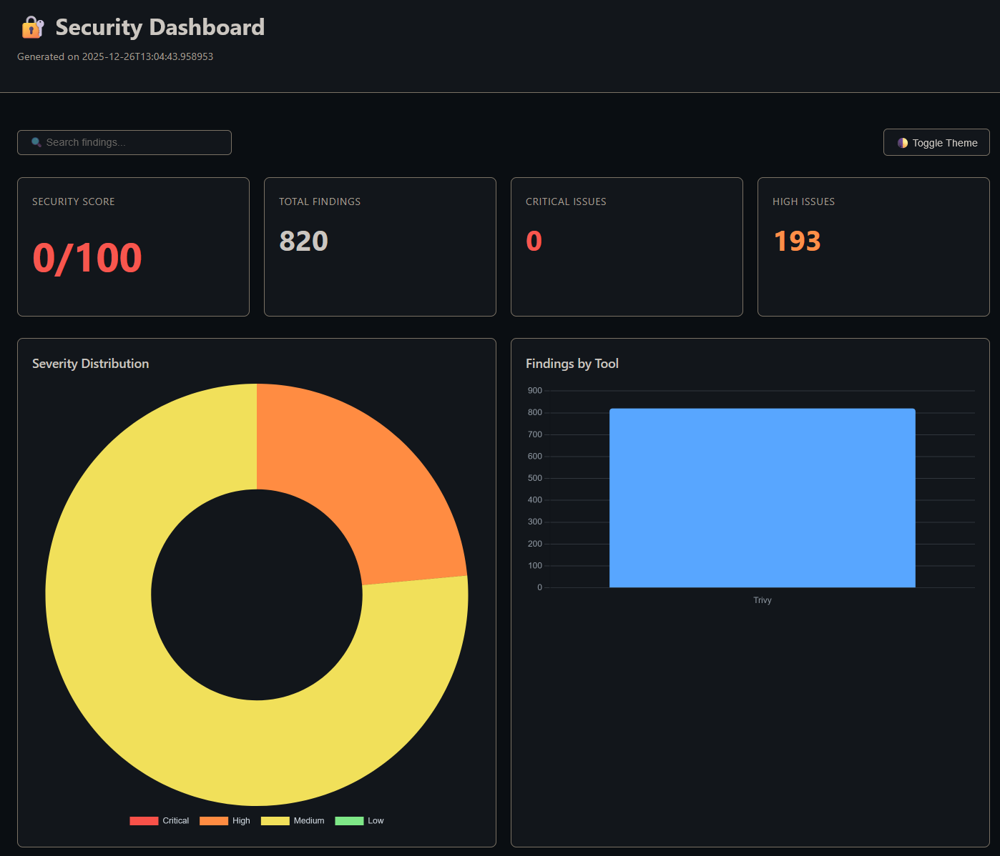
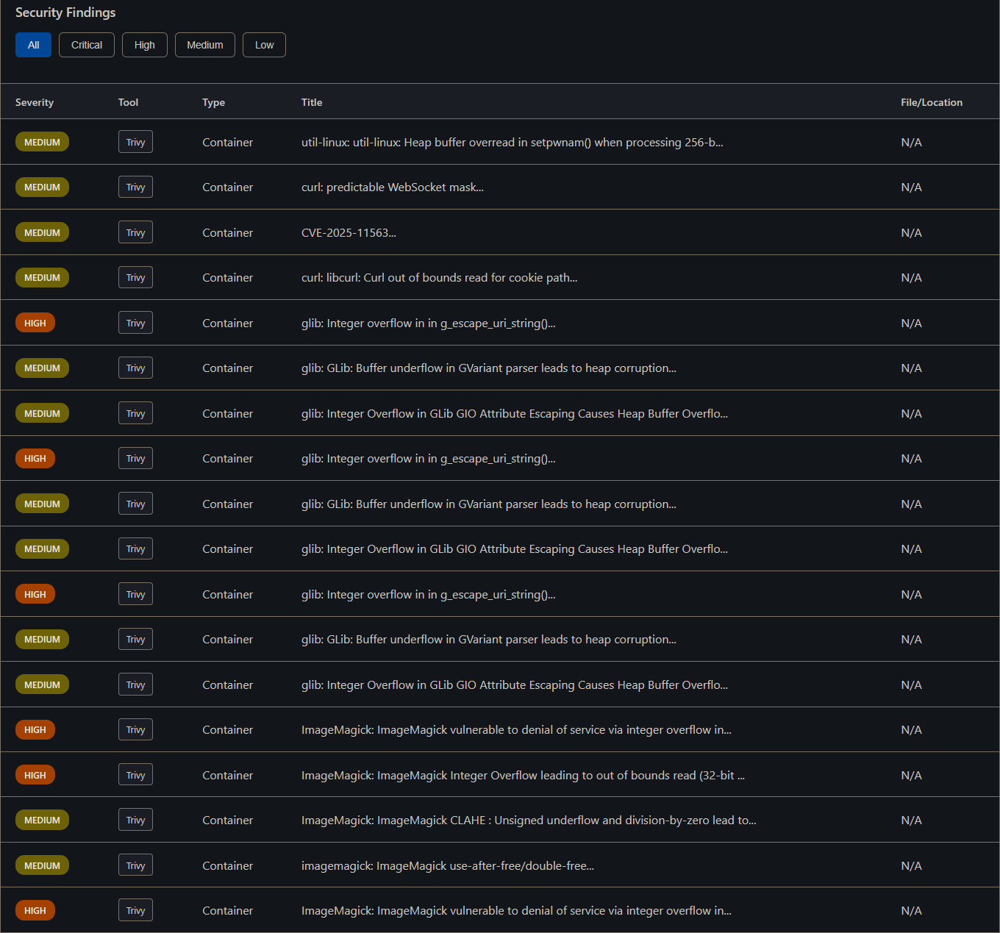
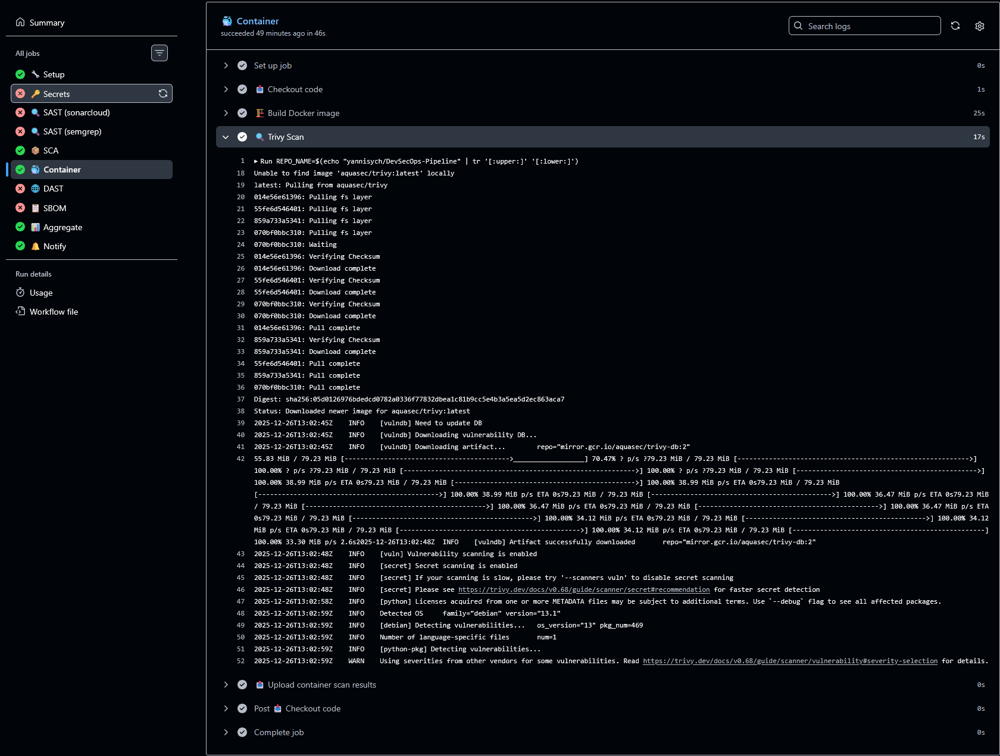

# DevSecOps Security Pipeline

[](https://github.com/yannisych/DevSecOps-Pipeline/actions/workflows/security-pipeline.yml)
[](https://opensource.org/licenses/MIT)

Automated security pipeline that scans code, containers, and dependencies for vulnerabilities using industry-standard tools. Built with GitHub Actions and designed for production environments.

## What This Does

This pipeline automatically runs comprehensive security scans on every code push:

- **Static Analysis (SAST)**: SonarCloud & Semgrep scan source code for security vulnerabilities
- **Dependency Scanning (SCA)**: OWASP Dependency-Check finds vulnerable libraries
- **Container Security**: Trivy scans Docker images for CVEs
- **Secret Detection**: TruffleHog & Gitleaks prevent credential leaks
- **Dynamic Testing (DAST)**: OWASP ZAP tests running applications
- **Quality Gates**: Automatically blocks deployment if security thresholds are breached

**Total scan time**: ~6 minutes | **Jobs**: 11 parallel | **Zero jobs skipped**

## Pipeline Results

### Complete Workflow Execution



**What you see**:
- ✅ **4 successful jobs**: Setup, SCA, Aggregate, Notify
- ❌ **7 failed jobs**: Security scans detected vulnerabilities (intentional)
- Quality Gate blocked deployment due to security policy violations
- All jobs completed - reports generated despite scan failures

### SonarCloud Code Analysis



Professional static analysis showing detected security issues, code smells, and maintainability metrics.

### Security Dashboard



Auto-generated HTML dashboard with vulnerability breakdown by severity and security score calculation.



Detailed findings from all security tools with remediation recommendations.

### Container Scan Results



Container vulnerability scan showing CVEs detected in Docker images.

## Important: Intentional Vulnerabilities

The `sample-app/` directory contains a **deliberately vulnerable Flask application** designed to demonstrate security tool effectiveness. It includes:

- SQL Injection vulnerabilities
- Cross-Site Scripting (XSS)
- Hardcoded API keys and secrets
- Weak cryptography (MD5)
- Path traversal flaws
- Insecure Docker configuration

**Why**: The pipeline failures prove that security tools are working correctly and would prevent deployment of insecure code in production environments.

## Security Quality Gates

The pipeline enforces security thresholds:

```yaml
Critical Vulnerabilities: 0 allowed (hard block)
High Vulnerabilities: Maximum 5 allowed
Security Score: Minimum 50/100 required
```

If any threshold is exceeded, the pipeline fails and deployment is blocked with detailed feedback on what needs to be fixed.

## Technology Stack

**CI/CD**: GitHub Actions
**Languages**: Python 3.11, YAML
**Container**: Docker
**Security Tools**:
- SonarCloud, Semgrep (SAST)
- OWASP Dependency-Check (SCA)
- Trivy (Container)
- TruffleHog, Gitleaks (Secrets)
- OWASP ZAP (DAST)
- Syft, Grype (SBOM)

## Quick Start

1. **Fork this repository**

2. **Configure secrets** in GitHub Settings → Secrets:
   ```
   SONAR_TOKEN - SonarCloud authentication
   SLACK_WEBHOOK - (Optional) Slack notifications
   ```

3. **Update workflow configuration** in `.github/workflows/security-pipeline.yml`:
   ```yaml
   env:
     SONAR_ORGANIZATION: 'your-org'
     SONAR_PROJECT_KEY: 'your-project-key'
   ```

4. **Push code** to trigger the pipeline

The pipeline runs automatically on:
- Push to `main`, `develop`, or `staging` branches
- Pull requests
- Daily at 2 AM UTC (scheduled)
- Manual workflow dispatch

## Pipeline Architecture

```
Setup → Parallel Scans → Aggregate Reports → Quality Gate → Notify
         (SAST, SCA,
          Container,
          Secrets,
          DAST, SBOM)
```

**Key Feature**: Pipeline resilience ensures all jobs complete even when security scans fail, providing complete visibility into security issues before blocking deployment.

## Project Structure

```
.
├── .github/workflows/
│   └── security-pipeline.yml    # Main CI/CD pipeline
├── scripts/
│   ├── aggregate-reports.py     # Consolidate scan results
│   ├── generate-dashboard.py    # Create HTML dashboard
│   ├── compliance-reporter.py   # Generate compliance reports
│   └── notifications.py         # Multi-channel alerts
├── sample-app/
│   ├── app.py                   # Vulnerable Flask application
│   └── Dockerfile               # Intentionally insecure container
├── security-tools/              # Tool configurations
└── docs/                        # Additional documentation
```

## Generated Artifacts

Each pipeline run produces:
- **Security Dashboard** (HTML) - Interactive vulnerability report
- **Consolidated Report** (JSON) - All findings in structured format
- **Compliance Reports** (PDF/JSON) - PCI-DSS, OWASP, CIS, NIST mappings
- **SBOM** (CycloneDX) - Software Bill of Materials

## License

MIT License - see [LICENSE](LICENSE) file for details.

## Contributing

See [CONTRIBUTING.md](docs/CONTRIBUTING.md) for guidelines.

---

**Note**: This is a portfolio/demonstration project showcasing DevSecOps best practices. The intentionally vulnerable application should never be deployed to production environments.
