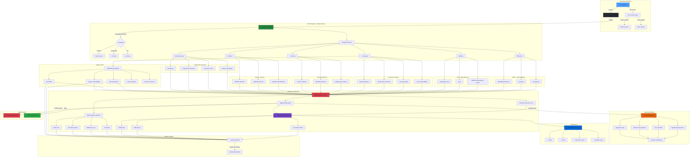

# Architecture Diagram

```mermaid
graph TB
    subgraph "Developer Workflow"
        A[👨‍💻 Developer] -->|git push| B[GitHub Repository]
        A -->|git commit| C[Pre-commit Hooks]
        C -->|Secrets Check| D[detect-secrets]
        C -->|Code Quality| E[black, flake8]
    end

    subgraph "CI/CD Pipeline - GitHub Actions"
        B -->|Trigger| F[🔧 Setup & Config]
        F -->|Language Detection| G{Language?}
        G -->|Python| H1[Python Tools]
        G -->|JavaScript| H2[JS Tools]
        G -->|Go| H3[Go Tools]
        
        F --> I[Parallel Execution]
        
        I --> J1[🔍 SAST]
        I --> J2[📦 SCA]
        I --> J3[🐳 Container]
        I --> J4[🔑 Secrets]
        I --> J5[🌐 DAST]
        I --> J6[☸️ K8s Security]
    end

    subgraph "SAST - Static Analysis"
        J1 --> K1[SonarCloud]
        J1 --> K2[Semgrep]
        J1 --> K3[Bandit/ESLint/Gosec]
    end

    subgraph "SCA - Dependencies"
        J2 --> L1[OWASP Dependency-Check]
        J2 --> L2[Snyk]
        J2 --> L3[npm/pip/go audit]
    end

    subgraph "Container Security"
        J3 --> M1[Trivy Vulnerabilities]
        J3 --> M2[Trivy Misconfig]
        J3 --> M3[Dockle Best Practices]
        J3 --> M4[ClamAV Malware]
    end

    subgraph "Secrets Detection"
        J4 --> N1[TruffleHog Git History]
        J4 --> N2[Gitleaks Real-time]
        J4 --> N3[Custom Patterns]
    end

    subgraph "DAST - Runtime"
        J5 --> O1[OWASP ZAP Baseline]
        J5 --> O2[OWASP ZAP Full]
        J5 --> O3[OWASP ZAP API]
    end

    subgraph "Kubernetes Security"
        J6 --> P1[Kubesec Manifests]
        J6 --> P2[kube-bench CIS]
        J6 --> P3[Polaris Best Practices]
        J6 --> P4[KubeLinter]
    end

    subgraph "Supply Chain"
        J3 --> Q1[📋 SBOM Generation]
        Q1 --> Q2[Syft CycloneDX]
        Q1 --> Q3[Syft SPDX]
        Q1 --> Q4[Grype Vulnerabilities]
        Q1 --> Q5[Cosign Signing]
        Q1 --> Q6[SLSA Provenance]
    end

    subgraph "Analysis & Reporting"
        K1 & K2 & K3 & L1 & L2 & L3 & M1 & M2 & M3 & M4 & N1 & N2 & N3 & O1 & O2 & O3 & P1 & P2 & P3 & P4 & Q2 & Q3 & Q4 --> R[📊 Aggregate Reports]
        
        R --> S1[Calculate Security Score]
        R --> S2[Apply Quality Gates]
        S1 & S2 --> T[🎨 Generate Dashboard]
        
        T --> U1[Interactive HTML]
        T --> U2[PDF Report]
        T --> U3[JSON Data]
        
        R --> V[📋 Compliance Reports]
        V --> V1[PCI-DSS]
        V --> V2[OWASP Top 10]
        V --> V3[CIS Benchmarks]
        V --> V4[NIST CSF]
    end

    subgraph "Auto-Remediation"
        S2 -->|Fixable Issues| W[🔧 Auto-Remediate]
        W --> W1[Update Dependencies]
        W --> W2[Fix Dockerfile]
        W --> W3[Add Security Headers]
        W --> W4[Upgrade Crypto]
        W1 & W2 & W3 & W4 --> X[Create Pull Request]
    end

    subgraph "Notifications"
        T --> Y[🔔 Multi-Channel Alerts]
        Y --> Y1[💬 Slack]
        Y --> Y2[📧 Email]
        Y --> Y3[🔵 Microsoft Teams]
        Y --> Y4[📝 GitHub Issues]
    end

    subgraph "Quality Gates"
        S2 -->|Critical Found| Z1[❌ Block Deployment]
        S2 -->|Pass| Z2[✅ Allow Deployment]
    end

    subgraph "Artifact Storage"
        U1 & U2 & U3 & V1 & V2 & V3 & V4 & Q2 & Q3 --> AA[💾 GitHub Artifacts]
        AA -->|Retention 90 days| AB[Download Reports]
    end

    style A fill:#4a9eff
    style B fill:#24292f
    style F fill:#22863a
    style R fill:#d73a49
    style T fill:#6f42c1
    style W fill:#e36209
    style Y fill:#0366d6
    style Z2 fill:#28a745
    style Z1 fill:#d73a49
```
